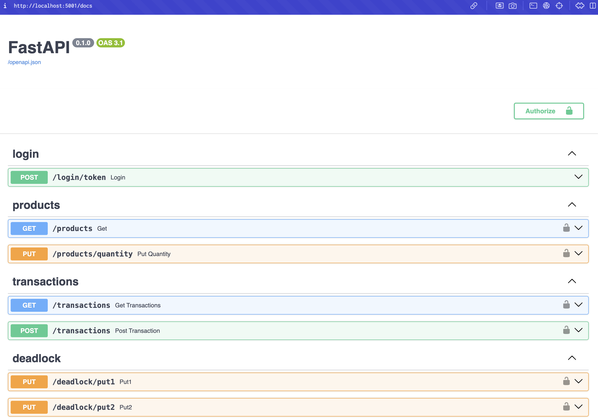

# Part 2 : Monitoring & Observability Demo Setup Guide (elastic-apm)

<details>
   <summary>Part 2 instructions</summary>
This section covers the setup and usage of Elastic APM for application performance monitoring of our FastAPI service.

## System Architecture

### Overview

```txt
                    +----------------+
                    |    Kibana     |
                    |   (Port 5601) |
                    +-------+--------+
                            |
                            | Visualizes
                            |
                    +-------v--------+
                    | Elasticsearch  |
                    |  (Port 9200)  |
                    +-------+--------+
                            |
                    +-------v--------+
                    |  APM Server   |
                    |  (Port 8200)  |
                    +-------+--------+
                            |
                    Collects Traces
                            |
            +---------------+----------------+
            |                               |
    +-------v--------+              +-------v--------+
    |    FastAPI     |              |    Redis      |
    |   (Port 5001)  +------------->|   (Port 6379) |
    +-------+--------+              +----------------+
            |
            v
    +----------------+
    |   PostgreSQL   |
    |   (Port 5432)  |
    +----------------+
```

In this stack, Redis serves several important purposes:

### Authentication and Session Management

When users log in, their credentials and session data are cached in Redis with a 1-hour TTL.
The `load_user` function first checks Redis for user data before falling back to the in-memory list.
This provides fast authentication without hitting the database.

### Performance Optimization

Redis acts as a fast, in-memory cache layer.
User data is cached after the first lookup, making subsequent authentications faster.
The TTL ensures the cache doesn't grow indefinitely and stays fresh.

### Resilient Design

The system can still function if Redis is down (falls back to in-memory list).
Failed Redis operations are logged but don't break the application.
Automatic retry mechanisms for cache operations.

### APM Integration

Elastic APM monitors Redis operations.
Provides visibility into cache performance.
Helps identify issues with session management.

The Redis integration helps the application handle high loads by:

* Reducing authentication overhead by caching user data
* Providing fast session lookups for authenticated users
* Enabling stateless application scaling and load balancing
* Supporting concurrent access patterns


### Component Roles

1. **Elastic APM Server**
   - Receives and processes APM data from instrumented applications
   - Forwards processed data to Elasticsearch
   - Provides configuration for APM agents

2. **Elasticsearch**
   - Stores APM data (traces, metrics, logs)
   - Enables fast search and analysis
   - Provides data for Kibana visualization

3. **Kibana**
   - Visualizes APM data
   - Provides APM-specific UI for:
     - Transaction overview
     - Error tracking
     - Service maps
     - Performance metrics

4. **Instrumented Services**
   - FastAPI with elastic-apm Python agent
   - Automatic instrumentation for:
     - HTTP requests
     - Database queries
     - Redis operations

5. **redis**
   - Key-value store for session management

6. **PostgreSQL**
   - Database for storing product and vendor data

## Setup Instructions

### 1. Environment Setup 

<details>
<summary>Manual - OLD school</summary>

1. Ensure all required files are in place :

```bash
# Check docker-compose.yml and related files
ls -la elastic_apm/
ls -la elastic_apm/requirements/fastapi/
ls -la elastic_apm/requirements/postgres/
```

2. Go to the `elastic_apm` directory and start the services:

```bash
# Navigate to elastic_apm directory
cd elastic_apm

# Start all services (or docker-compose for older docker version)

# for linux user
docker compose -f docker-compose.linux.yml build; docker compose -f docker-compose.linux.yml up -d

# for mac user
#docker compose -f docker-compose.mac.yml build; docker compose -f docker-compose.mac.yml up -d

# Verify services are running (or docker-compose for older docker version)
docker compose ps
```

3. Data Import

Import initial data for testing :

```bash
# Import products and vendors
#docker compose exec postgres-apm psql -U suppliers -d suppliers -f /client/import.sql
docker compose -f docker-compose.mac.yml exec postgres-apm psql -U suppliers -d suppliers -f /client/import.sql 
```

In the `docker-compose.yml` file, the `postgres-apm` service is configured to use the `import.sql` file to initialize the database (what we didn't do in the previous part 1). This why this command works.

</details>

simply run :

```bash
make
```

The command will build and start all services, wait for them to be ready and import data into PostgreSQL.

### 4. Verify Setup

1. **Check Kibana**
   - Open http://localhost:5601
   - Navigate to APM under Observability
   - Verify FastAPI service appears

   

2. **Check FastAPI**
   - Open http://localhost:5001/docs
   - Try some API endpoints
   - Check traces in Kibana APM

   

3. **Run Test Transactions**
   ```bash
   # Navigate to client directory
   cd ../client

   # activate virtual environment
   source venv/bin/activate
   
   # Run transaction script
   FASTAPI_PORT=5001 python 00-post_transactions_low.py localhost
   ```

## Monitoring Features

### 1. Transaction Monitoring
- View transaction response times
- Track SQL queries and their duration
- Monitor Redis operations
- Identify slow endpoints

### 2. Error Tracking
- View application errors in real-time
- Stack traces for debugging
- Error grouping and frequency analysis

### 3. Service Maps
- Visualize service dependencies
- Monitor inter-service communication
- Identify bottlenecks

### 4. Performance Metrics
- CPU and memory usage
- Request rates and latencies
- Database connection pool stats
- Custom metrics

## Troubleshooting

### 1. Common Issues

#### APM Data Not Showing
1. Check APM Server status:
   ```bash
   docker-compose logs apm-server
   ```
2. Verify FastAPI APM configuration:
   ```bash
   docker-compose logs fastapi-apm | grep ELASTIC_APM
   ```

#### Database Connection Issues
1. Check Postgres readiness:
   ```bash
   docker-compose exec postgres-apm pg_isready -U suppliers
   ```
2. Verify data import:
   ```bash
   docker-compose exec postgres-apm psql -U suppliers -d suppliers -c "SELECT COUNT(*) FROM products;"
   ```

#### Service Dependencies
1. Ensure proper startup order:
   - Elasticsearch must be ready before APM Server
   - Postgres must be ready before FastAPI
2. Check service health:
```bash
docker-compose ps
```

### 2. Debugging Tips

1. **View Detailed Logs**

```sh
# APM Server logs
docker-compose logs -f apm-server

# FastAPI logs
docker-compose logs -f fastapi-apm

# Elasticsearch logs
docker-compose logs -f elasticsearch
```

2. **Check Elasticsearch Status**
```bash
curl localhost:9200/_cat/health
```

3. **Verify APM Integration**
```bash
curl localhost:8200
```

## Cleanup

To stop and remove all services:
```bash
# Stop containers (for linux users)
docker compose -f docker-compose.linux.yml down -v

# clean docker images
docker rmi -f $(docker images -q)
```