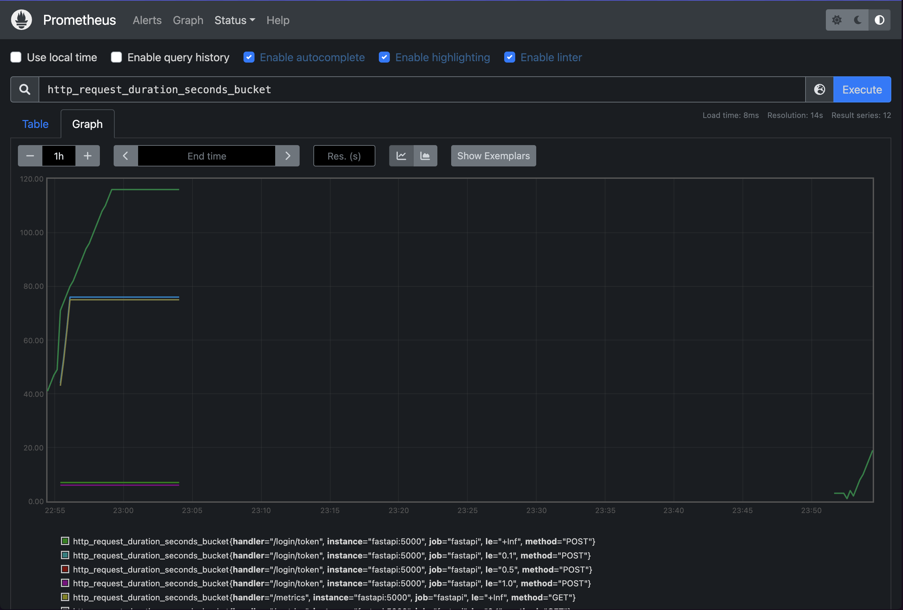

# Part 1 : Monitoring & Observability Demo Setup Guide (Prometheus & Grafana)

This guide provides step-by-step instructions for setting up and running the monitoring and observability demo. The demo includes a FastAPI application, PostgreSQL database, Prometheus for metrics collection, and Grafana for visualization.

## System Architecture

### Overview

```txt
                                    +----------------+
                                    |    Grafana    |
                                    |   (Port 3000) |
                                    +-------+--------+
                                            |
                                            | Visualizes
                                            |
                                    +-------v--------+
                                    |  Prometheus   |
                                    |  (Port 9090)  |
                                    +-------+--------+
                                            |
                                    Collects Metrics
                                            |
                    +--------------------+--+--+--------------------+
                    |                    |     |                    |
            +-------v--------+   +-------v-+   +--------+  +-------v--------+
            |    FastAPI     |   |  Redis  |   |Postgres|  |   Exporters   |
            |   (Port 5001)  |   |Port 6379|   |Port5432|  |(Various Ports)|
            +----------------+   +---------+   +--------+  +----------------+
```

### Component Roles
1. **FastAPI Application**
   - Handles HTTP requests for transactions and product management
   - Exposes metrics endpoint for Prometheus
   - Manages user authentication via Redis
   - Interacts with PostgreSQL for data persistence

2. **PostgreSQL Database**
   - Stores product catalog, vendor information, and transaction history
   - Maintains data consistency and relationships
   - Accessed via connection pool for better performance

3. **Redis**
   - Session and Authentication Cache:
     - Stores user authentication data with TTL (time-to-live)
     - Caches user credentials to reduce authentication overhead
     - Provides fast access to session information
   - Performance Optimization:
     - Reduces database load by caching frequent lookups
     - Enables quick user validation for API requests
     - Supports high-concurrency access patterns
   - Monitored by APM:
     - Tracks Redis operation latency
     - Monitors cache hit/miss rates
     - Provides visibility into session management

4. **Prometheus**
   - Scrapes metrics from all components
   - Stores time-series data
   - Provides query interface for Grafana

5. **Grafana**
   - Visualizes metrics from Prometheus
   - Provides customizable dashboards
   - Supports alerting based on metrics

### Data Flow

1. **Transaction Flow**

```txt
Client → FastAPI → PostgreSQL
  ↓         ↓         ↓
Request → Metrics → Storage
  ↓         ↓         ↓
Response ← Status ← Data
```

* FastAPI handles HTTP requests and generates metrics.
* Metrics are collected by Prometheus and stored in time-series data.
* PostgreSQL stores the actual data for the application.
   

2. **Metrics Flow**

```txt
Components → Exporters → Prometheus → Grafana
      ↓            ↓           ↓          ↓
   Generate → Collect → Store → Visualize
```

   * Components generate metrics (e.g., FastAPI, Redis, PostgreSQL).
   * Exporters collect metrics from components and send them to Prometheus.
   * Prometheus stores time-series data and provides metrics for Grafana.
   * Grafana visualizes metrics and provides dashboards for monitoring.

## Database Schema

### Entity Relationship Diagram

```txt
+-------------+     +-------------+     +---------------+
|   vendors   |     |  products   |     | transactions  |
+-------------+     +-------------+     +---------------+
| id (PK)     |     | id (PK)     |     | id           |
| qualification|     | name        |     | product_id(FK)|
+-------------+     | price       |     | vendor_id(FK) |
                    | quantity    |     | action        |
                    | req_qual    |     | quantity      |
                    +-------------+     | trans_date    |
                                      +---------------+
```

### Table Details

1. **vendors**
   - Purpose: Stores approved vendors and their qualifications
   - Key Fields:
     - `id`: UUID, primary key
     - `qualification`: CHAR(1), vendor's qualification level (A-C)
   - Relationships:
     - Referenced by transactions.vendor_id

2. **products**
   - Purpose: Manages product catalog and inventory
   - Key Fields:
     - `id`: UUID, primary key
     - `name`: VARCHAR(255), product name
     - `price`: DECIMAL(10,2), current price
     - `quantity`: INT, available stock
     - `required_qualification`: CHAR(1), minimum vendor qualification
   - Relationships:
     - Referenced by transactions.product_id

3. **transactions**
   - Purpose: Records all product movements
   - Key Fields:
     - `id`: UUID, transaction identifier
     - `product_id`: UUID, references products.id
     - `vendor_id`: UUID, references vendors.id
     - `action`: VARCHAR(50), 'withdrawal' or 'addition'
     - `quantity`: INT, number of items
     - `transaction_date`: TIMESTAMP, when the transaction occurred
   - Constraints:
     - Composite Primary Key (id, product_id)
     - Foreign Keys to products and vendors
     - Quantity must be positive

### Business Rules

1. Vendors can only handle products matching their qualification level
2. Product quantity cannot go below 0
3. Products with quantity < 50 trigger automatic resupply
4. All transactions are timestamped for audit purposes

## Prerequisites

- Docker and Docker Compose
- Python 3.8 or higher
- Git (to clone the repository)

## Quick Start

Only one command :

```bash
make
```

The import script will :

1. Truncate existing data (if any)
2. Import vendors with default qualification 'C'
3. Import products with their full details
4. You should see ~1,000 vendors and ~10,000 products after import

## Service Configuration

### FastAPI Application (Port 5001)
- Main application service handling transactions
- Metrics endpoint: http://localhost:5001/metrics
- Swagger UI: http://localhost:5001/docs
- Authentication: 
  - Username: a
  - Password: a

### Prometheus (Port 9091)
- Metrics collection and storage
- Web UI: http://localhost:9091
- Configured targets:
  - FastAPI application
  - PostgreSQL exporter
  - Node exporter

### Grafana (Port 3001)
- Metrics visualization
- Web UI: http://localhost:3001
- Default credentials:
  - Username: admin
  - Password: admin_password123

### PostgreSQL (Port 5433)
- Database: suppliers
- Username: suppliers
- Password: suppliers123
- Exporter Port: 9188

## Database Setup

### 1. Database Structure
The application uses three main tables:
- `vendors`: Stores vendor information and qualifications
- `products`: Stores product catalog with prices and requirements
- `transactions`: Records all transaction history

### 2. Data Import
The demo includes sample data in `demo/client/data/`:
- `vendors.csv`: 1,000 vendor records with qualifications
- `products.csv`: 10,000 product records with details
- `import.sql`: Database initialization script that:
  - Creates a PL/pgSQL function to handle vendors with missing qualifications
  - Imports vendors with default qualification 'C'
  - Imports products using PostgreSQL COPY command

To import the data (ALREADY DONE WITH THE MAKE COMMAND):

```bash
# From demo/prometheus_grafana directory
# 1. Wait for PostgreSQL to be ready (this is to check the connection)
docker exec postgres pg_isready -U suppliers

# 2. Create data directory and copy files
docker exec postgres mkdir -p /data
docker cp ../client/data/vendors.csv postgres:/data/
docker cp ../client/data/products.csv postgres:/data/
docker cp ../client/import.sql postgres:/

# 3. Import data (this will set all vendors to qualification 'C')
docker exec postgres psql -U suppliers -d suppliers -f import.sql

# 4. Verify the import
docker exec postgres psql -U suppliers -d suppliers -c "SELECT COUNT(*) FROM vendors;" ; docker exec postgres psql -U suppliers -d suppliers -c "SELECT COUNT(*) FROM products;"
```

The import script will :

1. Truncate existing data (if any)
2. Import vendors with default qualification 'C'
3. Import products with their full details
4. You should see ~1,000 vendors and ~10,000 products after import

## Running the Demo

### 1. Setup the client environment

Set up the client environment:

```bash
# go in the client folder
cd ../client

# create a venv
# python -m venv venv OLD fashion

# activate the venv
# source venv/bin/activate  # On Windows: venv\Scripts\activate

# install deps
# pip install -r requirements.txt # for the first time you run the demo

# using uv
uv venv && uv sync
```

### 2. Start Client Scripts

The demo includes several test scripts in `demo/client/`:

```bash
## Set FastAPI port (default is 5001)
## export FASTAPI_PORT=5001  # On Windows: set FASTAPI_PORT=5001
#
## Run scripts
#FASTAPI_PORT=5001  python 00-post_transactions_low.py localhost    # Low transaction volume
#FASTAPI_PORT=5001  python 01-wrong_vendor_id.py localhost          # Error cases
#FASTAPI_PORT=5001  python 02-post_transactions_high.py localhost   # High transaction volume
#FASTAPI_PORT=5001  python 03-resupply_products.py localhost        # Inventory management

make all-tests
```

### 3. Monitor in Grafana
1. Open http://localhost:3001
2. Log in with admin/admin_password123
3. Navigate to the "FastAPI Application" dashboard
4. Observe real-time metrics:
   - Transaction count per second
   - Response times
   - Error rates
   - Database metrics

### 4. Monitor in Prometheus
1. Open http://localhost:9091
2. Navigate to the "FastAPI Application" dashboard
3. Observe real-time metrics:
   - Transaction count per second
   - Response times
   - Error rates
   - Database metrics


See the slides to have some metrics to compare.

## Troubleshooting

### 1. Service Health Check
```bash
# Check all containers are running
docker-compose ps

# View service logs
docker-compose logs -f fastapi
docker-compose logs -f postgres
docker-compose logs -f prometheus
docker-compose logs -f grafana
```

### 2. Common Issues

#### No Metrics in Grafana
1. Check Prometheus targets:
   - Open http://localhost:9091/targets
   - Verify all targets are "UP"
2. Verify FastAPI metrics:
   - Open http://localhost:5001/metrics
   - Check metrics are being exposed

#### Database Connection Issues
1. Verify PostgreSQL is running:
   ```bash
   docker exec postgres pg_isready -U suppliers
   ```
2. Check database content:

   ```bash
   docker exec postgres psql -U suppliers -d suppliers -c "\dt"
   docker exec postgres psql -U suppliers -d suppliers -c "SELECT COUNT(*) FROM products;"
   ```

#### Client Script Errors
1. Verify environment:
   ```bash
   echo $FASTAPI_PORT  # Should show 5001
   ```
2. Check FastAPI logs:
   ```bash
   docker-compose logs -f fastapi
   ```

## Cleanup

To stop and remove all services:
```bash
docker-compose down
```

To remove all data (including volumes):
```bash
docker-compose down -v
```